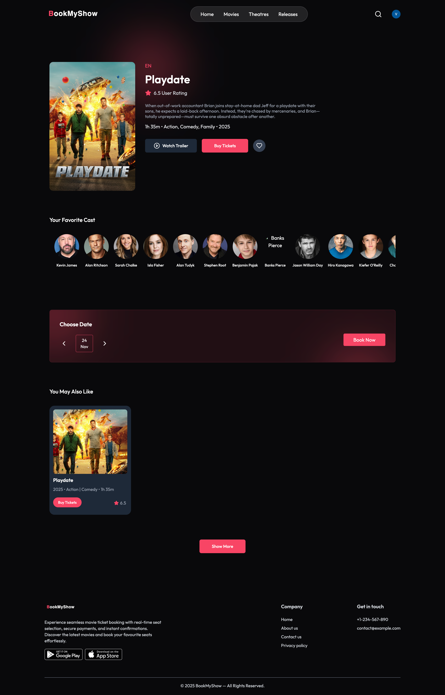
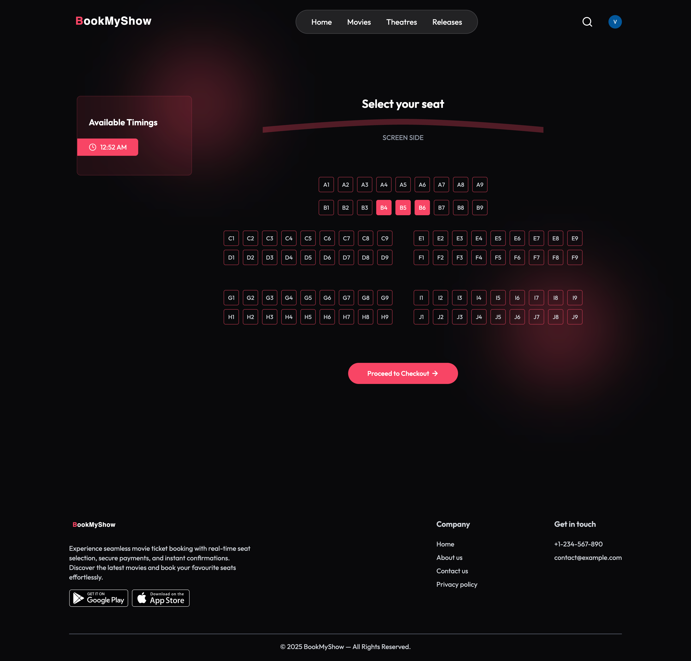
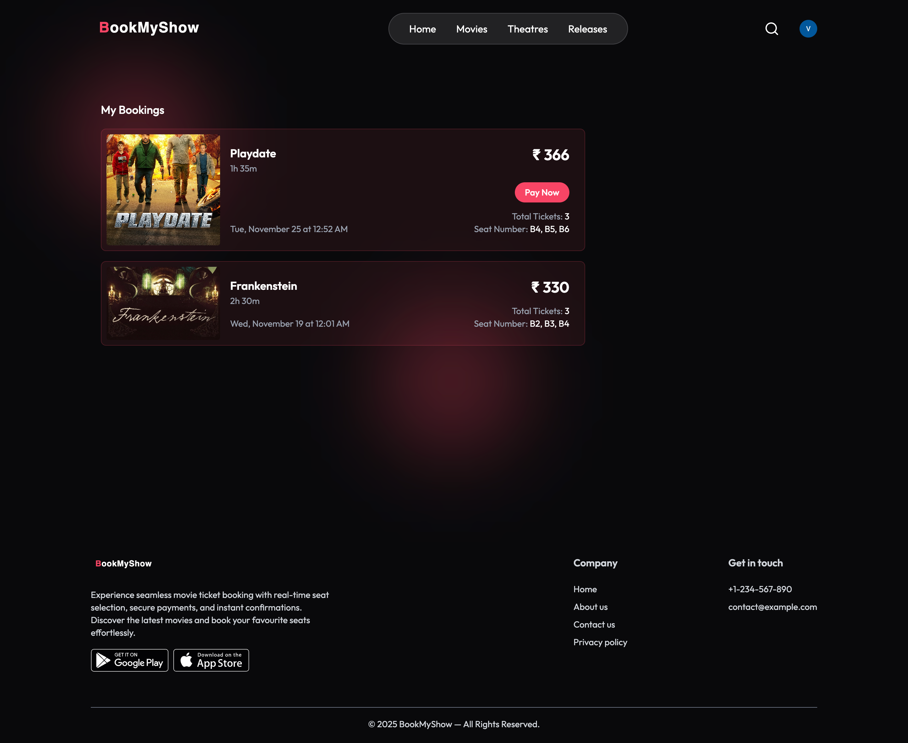
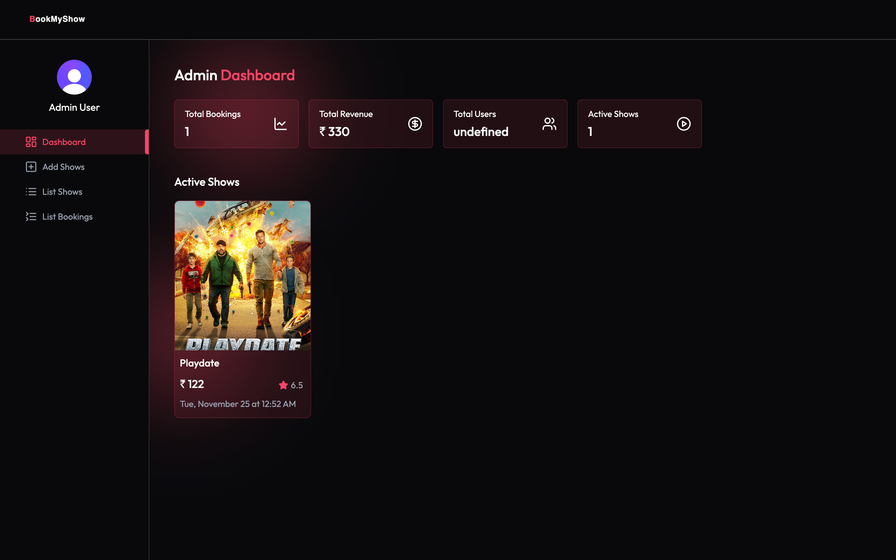
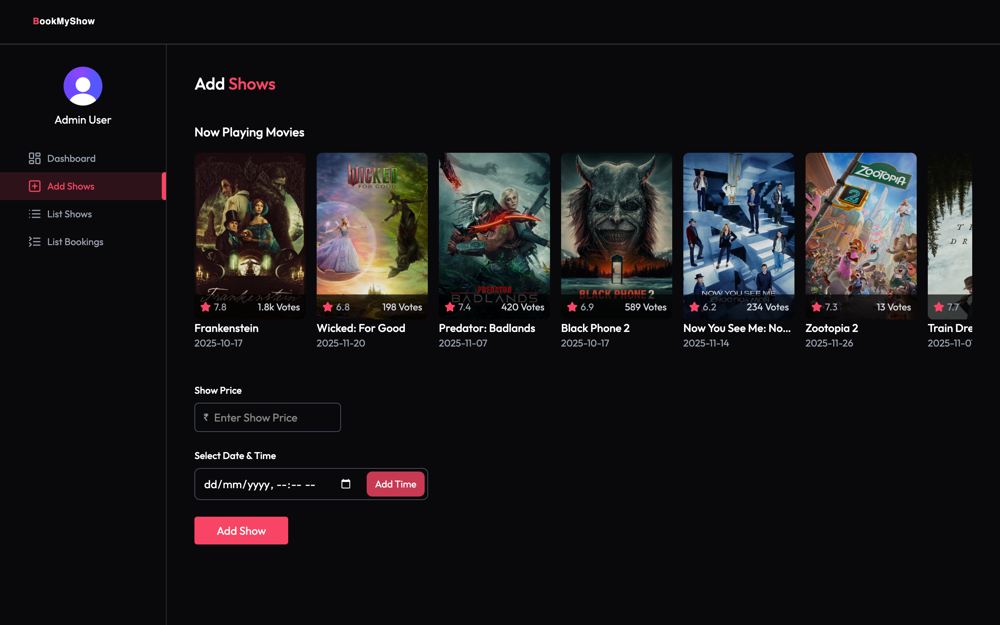
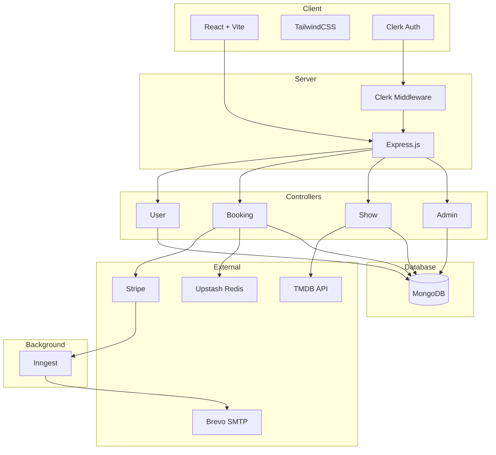
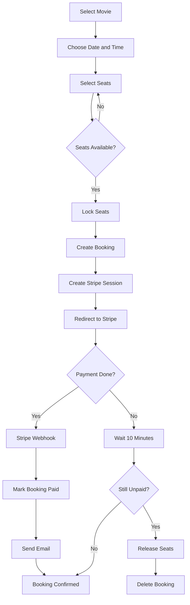
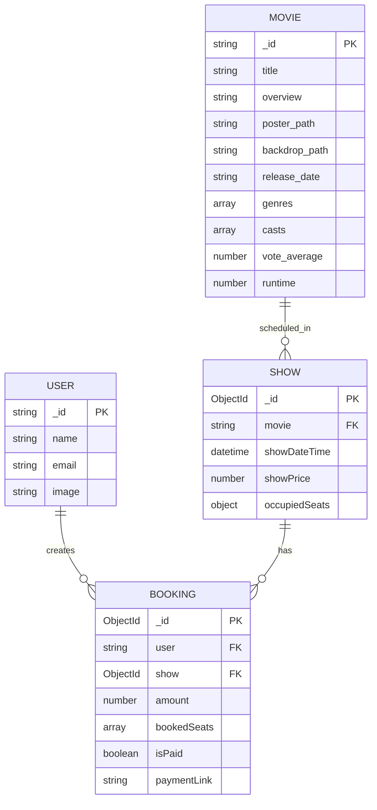

# BookMyShow Clone

A full-stack movie ticket booking application featuring real-time seat selection, automated booking workflows, secure Stripe payments, and an admin dashboard for show management.

## Live Demo

- Frontend: https://book-my-show-green-seven.vercel.app
- Backend API: https://bookmyshow-server-fawn.vercel.app

## Screenshots

### User Interface








### Admin Dashboard





## System Architecture



## Booking Flow



## Database Schema



## Features

### User Features

- Browse trending movies from TMDB with ratings and trailers
- Interactive seat selection with real-time availability
- Secure Stripe checkout with automatic session management
- Booking history with payment status and ticket details
- Save favorite movies for quick access

### Admin Features

- Dashboard with revenue, bookings, and user statistics
- Add shows with flexible date-time scheduling
- View all platform bookings and show listings

### Technical Features

- Automated seat release after 10 minutes for unpaid bookings
- Email confirmations via Brevo SMTP
- In-memory caching for trending movies
- Redis seat locking to prevent race conditions
- Stripe webhooks for real-time payment verification
- Role-based admin authorization via Clerk metadata

## Tech Stack

### Frontend

- React 19
- TypeScript
- Vite
- TailwindCSS
- Clerk
- React Router DOM
- Axios
- React Player

### Backend

- Node.js
- TypeScript
- Express
- MongoDB with Mongoose
- Clerk
- Stripe
- TMDB API
- Nodemailer with Brevo SMTP
- Inngest
- Upstash Redis

## Project Structure

```
bookmyshow/
├── client/
│   └── src/
│       ├── assets/
│       ├── components/
│       │   └── admin/
│       ├── constants/
│       ├── context/
│       ├── lib/
│       ├── pages/
│       │   └── admin/
│       └── types/
│
└── server/
    └── src/
        ├── configs/
        ├── controllers/
        ├── inngest/
        │   └── functions/
        ├── middleware/
        ├── models/
        ├── routes/
        ├── types/
        └── utils/
```

## API Endpoints

### Public Routes

| Method | Endpoint                   | Description             |
| ------ | -------------------------- | ----------------------- |
| GET    | /api/show/trending         | Get trending movies     |
| GET    | /api/show/home-trailers    | Get homepage trailers   |
| GET    | /api/show/all              | Get all available shows |
| GET    | /api/show/:movieId         | Get show details        |
| GET    | /api/booking/seats/:showId | Get occupied seats      |

### Protected User Routes

| Method | Endpoint                  | Description           |
| ------ | ------------------------- | --------------------- |
| GET    | /api/user/bookings        | Get user bookings     |
| POST   | /api/user/update-favorite | Toggle favorite movie |
| GET    | /api/user/favorites       | Get favorite movies   |
| POST   | /api/booking/create       | Create booking        |

### Admin Routes

| Method | Endpoint                | Description          |
| ------ | ----------------------- | -------------------- |
| GET    | /api/admin/is-admin     | Verify admin status  |
| GET    | /api/admin/dashboard    | Get dashboard data   |
| GET    | /api/admin/all-shows    | Get all shows        |
| GET    | /api/admin/all-bookings | Get all bookings     |
| GET    | /api/show/now-playing   | Get TMDB now-playing |
| POST   | /api/show/add           | Add new shows        |

### Webhooks

| Method | Endpoint     | Description               |
| ------ | ------------ | ------------------------- |
| POST   | /api/stripe  | Stripe payment webhook    |
| POST   | /api/inngest | Inngest function endpoint |

## Getting Started

### Prerequisites

- Node.js 20+
- pnpm
- MongoDB Atlas account
- Clerk account
- Stripe account
- TMDB API token
- Brevo account
- Upstash Redis account
- Inngest account

### Installation

```bash
git clone https://github.com/yourusername/bookmyshow-clone.git
cd bookmyshow-clone

cd server
pnpm install

cd ../client
pnpm install
```

### Environment Variables

Create `.env` files from `.env.example` in both client and server directories.

### Development

```bash
cd server
pnpm dev

cd client
pnpm dev
```

- Frontend: http://localhost:5173
- Backend: http://localhost:5000

## Admin Setup

1. Sign up through the app
2. In Clerk Dashboard, find your user
3. Add to privateMetadata: `{ "role": "admin" }`

## Author

Vikraman R - [@VIKRAMANR7](https://github.com/VIKRAMANR7)
