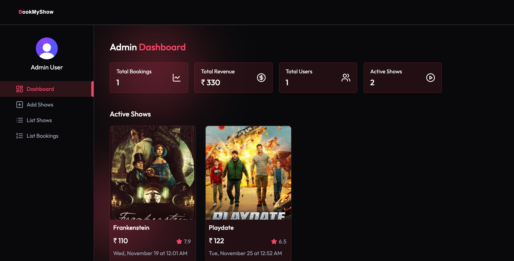

# 🎬 BookMyShow Clone — Full‑Stack Movie Ticket Booking Platform

A production-ready movie ticket booking platform inspired by BookMyShow, featuring real-time seat selection, secure payments, TMDB integration, Redis caching, and a fully functional Admin Dashboard.

---

## 📸 Screenshots

All screenshots should be stored at:

```
client/public/screenshots/
```

### 🔐 Authentication


### 🏠 Home Page


### 🎬 Movie Details


### 🪑 Seat Selection


### 🧾 Booking Confirmation


### ⭐ Movie Suggestions


### 🛠️ Admin Dashboard



---

## ✨ Key Features

### 🎥 Movie Management

- TMDB Integration — Trending movies, cast, posters
- Real‑time updates
- Redis caching (Upstash)

### 🎫 Booking System

- Interactive seat layout (A–J)
- Max 5 seats per booking
- Stripe Checkout payments
- Double‑booking protection

### 🔐 Authentication

- Clerk authentication (Google, GitHub, Email)
- JWT‑protected admin routes

### ⚡ Performance

- Redis caching for API responses
- Smart invalidation on show updates

### 📬 Email Automation

- Booking confirmation
- Show reminders
- Admin announcement emails

### 🎨 UI/UX

- Responsive modern UI
- TailwindCSS styling
- Smooth transitions & loading states

---

## 🛠️ Tech Stack

### Frontend

- React 19, TypeScript
- Vite, TailwindCSS
- Clerk Auth
- React Router
- Axios
- React Player

### Backend

- Node.js + Express + TypeScript
- MongoDB + Mongoose
- Stripe
- Inngest
- Upstash Redis
- TMDB API

---

## 📂 Project Structure

```
📁 project-root/
├── 📁 client/
│   ├── public/screenshots/
│   └── src/
│       ├── components/
│       ├── pages/
│       ├── context/
│       ├── types/
│       └── assets/
└── 📁 server/
    ├── controllers/
    ├── routes/
    ├── models/
    ├── configs/
    ├── middleware/
    ├── inngest/
    └── server.ts
```

---

## 🚀 Getting Started

### 1️⃣ Clone Repository

```
git clone https://github.com/VIKRAMANR7/BookMyShow
cd BookMyShow
```

### 2️⃣ Install Dependencies

```
cd server && pnpm install
cd ../client && pnpm install
```

### 3️⃣ Environment Variables

#### Backend (`server/.env`)

```
PORT=3000
MONGO_URI=mongodb+srv://...
TMDB_ACCESS_TOKEN=
STRIPE_SECRET_KEY=
STRIPE_WEBHOOK_SECRET=
UPSTASH_REDIS_REST_URL=
UPSTASH_REDIS_REST_TOKEN=
INNGEST_EVENT_KEY=
INNGEST_SIGNING_KEY=
```

#### Frontend (`client/.env`)

```
VITE_BASE_URL=http://localhost:3000
VITE_CLERK_PUBLISHABLE_KEY=
VITE_CLOUDINARY_BASE=
```

---

## ▶️ Run Development Servers

### Backend:

```
cd server
pnpm dev
```

### Frontend:

```
cd client
pnpm dev
```

### Inngest Dev Server:

```
cd server
npx inngest-cli@latest dev
```

Access at: **http://localhost:5173**

---

## 📡 API Overview

### Movies & Shows

- `GET /api/show/trending`
- `GET /api/show/home-trailers`
- `GET /api/show/:movieId`
- `POST /api/show/add` (Admin)

### Booking

- `POST /api/booking/create`
- `GET /api/booking/seats/:showId`

### User

- `GET /api/user/bookings`
- `POST /api/user/update-favorite`

### Admin

- `GET /api/admin/dashboard`
- `GET /api/admin/all-shows`
- `GET /api/admin/all-bookings`

---

## 🚀 Deployment (Vercel)

### Frontend Deploy

```
cd client
pnpm build
vercel --prod
```

### Backend Deploy

```
cd server
pnpm build
```

Set env vars → deploy via Git → add Stripe webhook.

---

## 🤝 Contributing

1. Fork repo
2. Create feature branch
3. Commit changes
4. Open pull request

---

## 📝 License

ISC License

---

## ⭐ Support

If this project helped you, please ⭐ star the repo!

Made with ❤️ by **Vikraman**
Github: https://github.com/VIKRAMANR7
